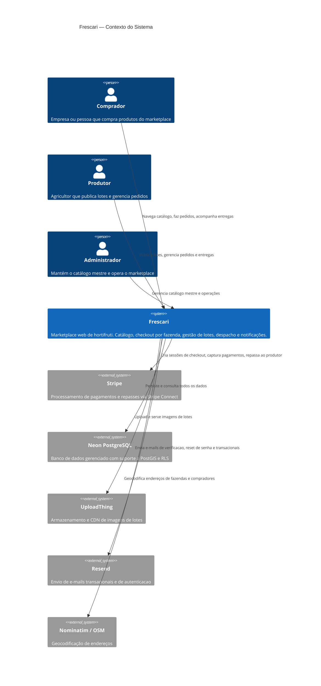
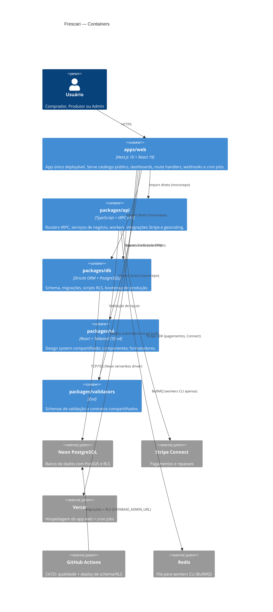
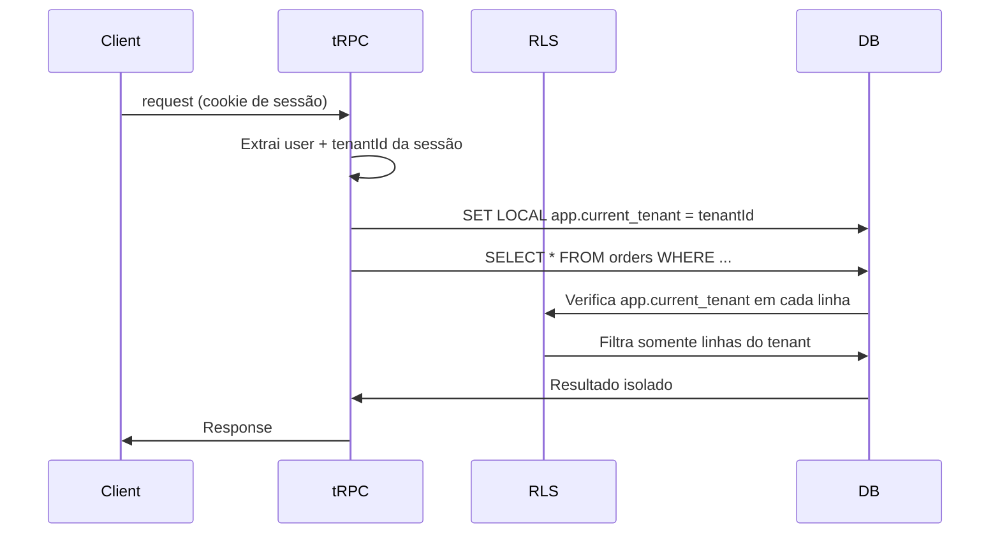
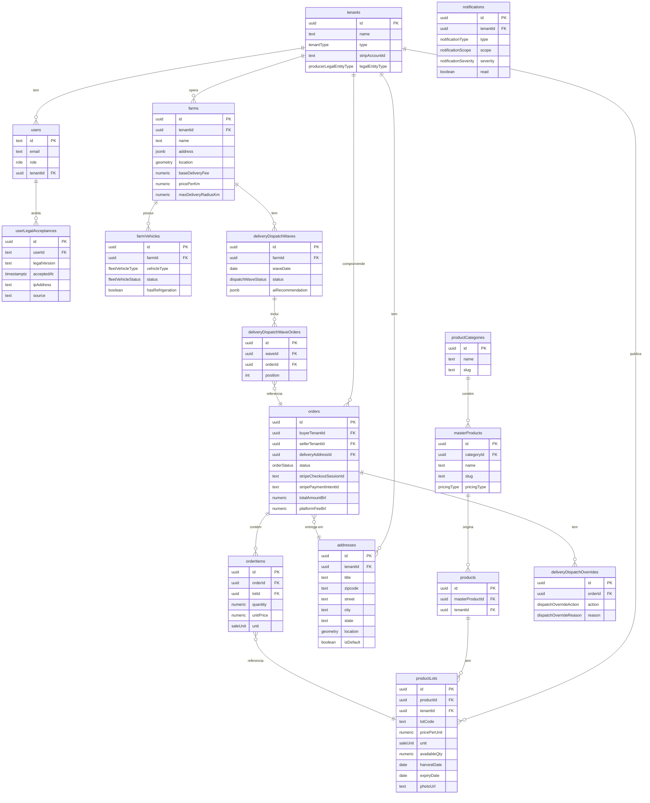
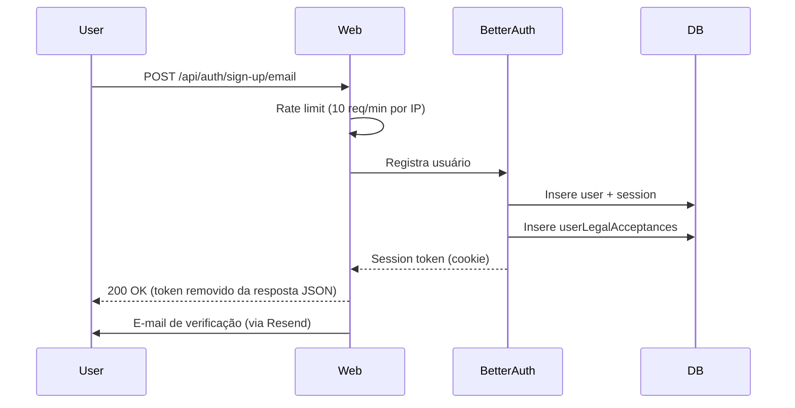
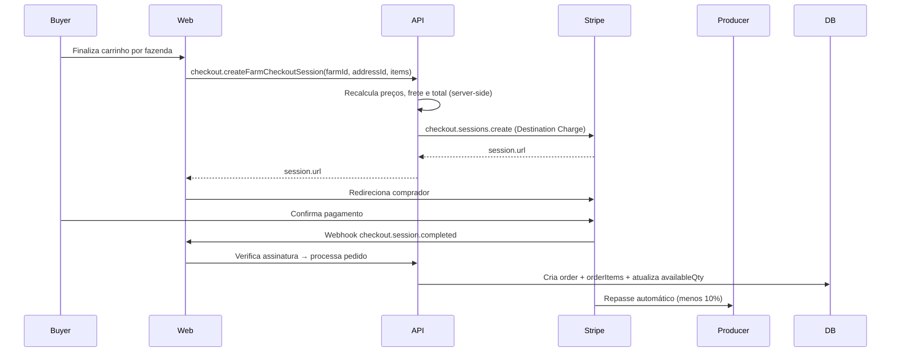

# Frescari — Arquitetura do Sistema

> Documento central de arquitetura. Consolida as decisões de produto, engenharia e operação da plataforma.
> Última atualização: 2026-04-09

---

## 1. Visão Geral

**Frescari** é um marketplace B2B/B2C de hortifruti operado como **"invisible SaaS"**: não operamos galpões nem estoques. Somos a infraestrutura digital que conecta produtores rurais a compradores e monetizamos via taxa de intermediação sobre cada transação.

### Princípios fundamentais

| Princípio | Descrição |
|-----------|-----------|
| **Backend como dono da verdade** | Preço, frete e total são sempre calculados no servidor. O frontend nunca é confiado para valores financeiros. |
| **Multi-tenancy estrutural** | Isolamento de dados via PostgreSQL RLS — não apenas na aplicação. |
| **Idempotência financeira** | Toda operação sensível ao Stripe usa chaves de idempotência. |
| **Menor privilégio** | O runtime da aplicação nunca usa credenciais com `BYPASSRLS`. |
| **Qualidade como gate** | Nenhum código chega à produção sem passar por `pnpm check` (lint + typecheck + test + knip). |
| **Soft delete** | Preferir marcação de inativo a hard delete em pedidos, lotes e pagamentos. |

---

## 2. Diagrama de Contexto (C4 — Nível 1)



---

## 3. Diagrama de Containers (C4 — Nível 2)



---

## 4. Multi-tenancy e Isolamento via RLS

### Modelo de tenants

| Papel | `role` | `tenantType` | Descrição |
|-------|--------|-------------|-----------|
| Comprador | `buyer` | `BUYER` | Empresa ou pessoa que compra |
| Produtor | `producer` | `PRODUCER` | Agricultor que publica lotes |
| Administrador | `admin` | — | Gerencia o marketplace |

### Como o isolamento funciona

1. **Na autenticação** — `Better Auth` associa `tenantId` e `role` ao usuário na sessão.
2. **No tRPC** — Cada tipo de procedure extrai `tenantId` do contexto e o injeta em todas as queries:
   - `publicProcedure` — sem auth
   - `protectedProcedure` — requer sessão válida
   - `tenantProcedure` — requer `tenantId`
   - `producerProcedure` / `buyerProcedure` — verifica role + tenantType
   - `adminProcedure` — somente admins
3. **No banco** — PostgreSQL RLS verifica `app.current_tenant` em toda query antes de retornar dados. O runtime usa uma role sem `BYPASSRLS`.



---

## 5. Contrato de API (tRPC)

### Estrutura de routers

| Router | Escopo | Principais operações |
|--------|--------|---------------------|
| `productRouter` | Público | Listagem e detalhes do catálogo |
| `lotRouter` | Produtor | CRUD de lotes, métricas de inventário |
| `checkoutRouter` | Comprador | Criação de sessão Stripe por fazenda |
| `orderRouter` | Comprador/Produtor | Pedidos, status, captura pós-pesagem |
| `farmRouter` | Produtor | Perfil, localização, frota, configurações |
| `stripeRouter` | Produtor | Onboarding Stripe Connect, status da conta |
| `addressesRouter` | Comprador | CRUD de endereços de entrega |
| `logisticsRouter` | Produtor/Admin | Despacho, ondas, overrides, torre de controle |
| `notificationRouter` | Autenticado | Inbox, leitura, badges |
| `adminRouter` | Admin | Catálogo mestre, usuários, operações |
| `onboardingRouter` | Autenticado | Fluxo de criação de tenant |

### Validação

- Todos os inputs são validados com **Zod** e o flag `.strict()` para rejeitar campos desconhecidos.
- Schemas compartilhados vivem em `packages/validators`.
- Identificadores são tipados como `.uuid()` para prevenir IDOR.

---

## 6. Modelo de Dados (ERD)



---

## 7. Autenticação e Autorização

### Stack de auth

- **Better Auth v1.6.1** com adapter Drizzle
- Sessões em cookies `HttpOnly; Secure; SameSite=Lax`
- Verificação de e-mail obrigatória antes de acesso completo
- Reset de senha por e-mail com token de 1 hora e revogação de sessões após redefinição
- Aceitação legal versionada (`userLegalAcceptances`) capturada no cadastro

### Fluxo de login/cadastro



### Proteções implementadas

- Token de sessão não retorna no JSON (apenas no cookie)
- Erros de "usuário já existe" são mascarados com mensagem genérica (anti-enumeração)
- Rate limiting: 10 tentativas por minuto por IP em `/sign-in/email`, `/sign-up/email`, `/request-password-reset` e no legado `/forget-password`

---

## 8. Fluxo de Pagamento (Stripe Connect)

### Modelo: Destination Charges

O comprador paga à plataforma. A plataforma retém a comissão (10%) e repassa o restante à conta conectada do produtor.



### Lifecycle de um pedido por peso

Para itens vendidos por peso (`kg`, `g`):
1. **Autorização** — captura o valor estimado (pré-pesagem)
2. **`order.status = awaiting_weight`** — produtor pesa o item
3. **Captura manual** — produtor informa peso real → backend calcula valor final e captura
4. **`order.status = confirmed`** — pedido segue para despacho

---

## 9. Logística e Frete

### Cálculo de frete

O frete é calculado server-side usando distância geoespacial entre o endereço do comprador e a fazenda:

```
frete = base_delivery_fee + (distância_km × price_per_km)
```

Restrições:
- Fazenda define `maxDeliveryRadiusKm`. Pedidos fora do raio são bloqueados.
- `ST_DistanceSphere(farm.location, address.location)` via PostGIS.

### Torre de controle de entregas

O módulo de logística (`logisticsRouter`) implementa:
- **Scoring de despacho** — prioridade por janela de entrega, risco e carga do veículo
- **Ondas de entrega** (`deliveryDispatchWaves`) — agrupamento de pedidos por dia/fazenda
- **Overrides manuais** — operador pode reordenar, atrasar ou fixar pedidos no topo
- **Sugestão por IA** — heurísticas automáticas de ordem e risco persistidas como `aiRecommendation` (JSON)

Para detalhes completos: [`docs/guides/deliveries-control-tower.md`](guides/deliveries-control-tower.md)

---

## 10. Deployment e DevOps

### Ambientes

| Ambiente | App | Schema/RLS | Trigger |
|----------|-----|-----------|---------|
| Preview | Vercel (por PR) | Staging Neon | Automático em PR |
| Staging | Vercel (`main`) | Staging Neon | Automático em push |
| Production | Vercel (`main`) | Production Neon | Manual (`deploy-production.yml`) |

### Workflows GitHub Actions

| Workflow | Trigger | O que faz |
|----------|---------|-----------|
| `ci.yml` | PRs + push | lint + typecheck + test + knip |
| `deploy-staging.yml` | Push em `main` ou mudança em `packages/db/` | Aplica migrações + RLS em staging |
| `deploy-production.yml` | Manual | Aplica migrações + RLS em produção |

### Cron jobs (Vercel)

Configurados em `vercel.json`:

| Rota | Horários UTC | Função |
|------|-------------|--------|
| `/api/cron/freshness` | 00h, 06h, 12h, 18h | Atualiza status de lotes expirados/vencendo |
| `/api/cron/notifications` | 01h, 07h, 13h, 19h | Processa fila de notificações |

### Branches Neon

- `main` — desenvolvimento e preview
- `staging` — branch de staging (auto-deploy)
- `production-v1-clean` — branch de produção (deploy manual apenas)

---

## 11. Workers e Jobs

Os workers CLIs usam **BullMQ + Redis** e rodam fora da Vercel (localmente ou em infra separada):

| Worker | Arquivo | Função |
|--------|---------|--------|
| `lot-freshness-cli` | `packages/api/src/workers/lot-freshness-cli.ts` | Versão CLI do job de frescor de lotes |
| `notification-worker-cli` | `packages/api/src/workers/notification-worker-cli.ts` | Processamento de fila de notificações |
| `stripe-connect-backfill-cli` | `packages/api/src/workers/stripe-connect-backfill-cli.ts` | Sincroniza dados de contas Stripe |
| `stripe-connect-legacy-audit-cli` | `packages/api/src/workers/stripe-connect-legacy-audit-cli.ts` | Audita contas Stripe legadas |

> Os cron jobs no Vercel (`/api/cron/*`) executam as mesmas tarefas inline, sem Redis, usando a implementação direta dos serviços.

---

## 12. Qualidade e Testes

### Quality gate (`pnpm check`)

```
pnpm lint        → ESLint 9 + TypeScript ESLint
pnpm typecheck   → tsc --noEmit (strict mode + noUncheckedIndexedAccess)
pnpm test        → tsx --test (Node.js built-in test runner)
pnpm knip        → Dead code detection
```

### Cobertura de testes (58 arquivos)

| Camada | Arquivos | Tipo |
|--------|---------|------|
| E2E Playwright | 3 | Buyer core, Producer/Logistics, Admin |
| packages/api | 24 | Routers, segurança, workers, flows |
| apps/web | 23 | Rotas API, componentes, utilitários |
| packages/db | 2 | Integração RLS real (não mockada) |
| packages/ui | 1 | Formatadores |
| packages/validators | 3 | Schemas Zod |

### Proteções de commit

- **Husky** — bloqueia commit com falha em typecheck/lint
- **lint-staged** — roda checks apenas em arquivos staged
- **Branch protection** — `main` requer `quality` check + aprovação admin

---

## 13. Modelo Operacional do Catálogo

```
Admin cria categoria → Admin cria produto-base (masterProduct)
                                        ↓
Produtor publica lote (productLot) vinculado ao masterProduct
                ↓ (define: preço, unidade, quantidade, foto, colheita, validade)
                        ↓
Catálogo público exibe lotes disponíveis
                ↓
Comprador adiciona ao carrinho → Checkout por fazenda → Pedido
```

Regras:
- Produtor **não cria** taxonomia paralela — vincula ao catálogo mestre
- `admin` é o único papel que cria `masterProduct` e `productCategory`
- O lote é a oferta comercial real: preço e unidade são definidos no lote, não no produto-base

---

## 14. Referências

| Documento | Localização | Conteúdo |
|-----------|------------|----------|
| ADRs | [`docs/adr/`](adr/README.md) | Decisões arquiteturais numeradas |
| Torre de controle | [`docs/guides/deliveries-control-tower.md`](guides/deliveries-control-tower.md) | Especificação do módulo de logística |
| Padrões UI/UX | [`docs/guides/ui-ux-standards.md`](guides/ui-ux-standards.md) | Design system e padrões visuais |
| SEO e crescimento | [`docs/guides/seo-and-growth-strategy.md`](guides/seo-and-growth-strategy.md) | Estratégia de SEO e loops de crescimento |
| Bootstrap de produção | [`docs/operations/launch-bootstrap-runbook.md`](operations/launch-bootstrap-runbook.md) | Promoção de admin e catálogo inicial |
| Deploy de RLS | [`docs/operations/rls-rollout-runbook.md`](operations/rls-rollout-runbook.md) | Procedimento de RLS |
| Go-live Stripe | [`docs/operations/stripe-go-live-runbook.md`](operations/stripe-go-live-runbook.md) | Ativação do Stripe Connect em produção |
| Backup e recovery | [`docs/operations/backup-restore-runbook.md`](operations/backup-restore-runbook.md) | Procedimentos de recuperação |
| Checklist de segurança | [`docs/operations/security-checklist.md`](operations/security-checklist.md) | Validação pré-lançamento |
